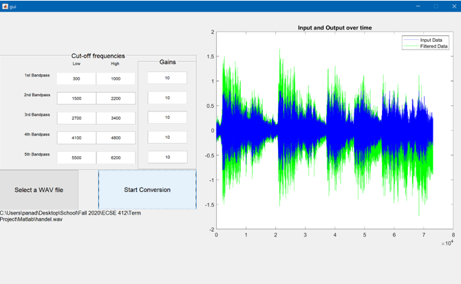

# ECSE512
Final Project
How to use our program:
1.	Run the gui.m file to start the GUI
2.	Press “Select a WAV file” to choose a a custom .wav file, otherwise the default input is the handel.wav file
3.	For each of the 5 bandpasses, type in your desired Low and High cut-off frequencies, as well as your desired gains
4.	Press “Start Conversion” to begin filtering.

